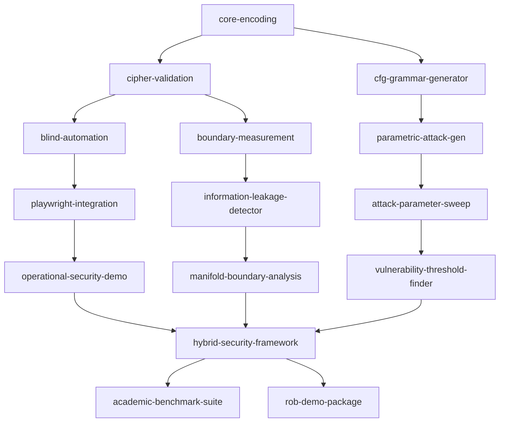

# Caesar+CFG Security Framework - Lattice Architecture

## Dependency Lattice (LDD Specification)

## Module Specifications

### T0: Foundation Layer

#### `core-encoding` (Independent)
**Contract**: Universal A→J Caesar cipher with 100% round-trip accuracy
**Dependencies**: None
**Outputs**: encode(text) → cipher_text, decode(cipher_text) → text
**BDD**: Perfect accuracy on any UTF-8 input

#### `cipher-validation` (Depends: core-encoding)
**Contract**: Statistical validation framework for encoding accuracy
**Dependencies**: core-encoding
**Outputs**: bootstrap_ci(), cross_validation(), accuracy_metrics()
**BDD**: 1000 bootstrap samples, 95% confidence intervals

#### `cfg-grammar-generator` (Independent)
**Contract**: Parametric CFG generation following Zerbik methodology
**Dependencies**: None  
**Outputs**: generate_grammar(k, b, M) → CFG instance
**BDD**: Generate valid CFGs across parameter space (k,b,|M|)

### T1: Operational Layer

#### `blind-automation` (Depends: cipher-validation)
**Contract**: Playwright automation with content hiding
**Dependencies**: cipher-validation
**Outputs**: navigate_blind(encoded_url), type_blind(encoded_text)
**BDD**: Successful automation with zero content exposure to LLM

#### `boundary-measurement` (Depends: cipher-validation)
**Contract**: Information flow analysis across inference↔execution boundary
**Dependencies**: cipher-validation
**Outputs**: track_boundary_crossing(), measure_leakage()
**BDD**: Detect information leakage with 4 different metrics

#### `parametric-attack-gen` (Depends: cfg-grammar-generator)
**Contract**: Generate attacks across CFG parameter space
**Dependencies**: cfg-grammar-generator
**Outputs**: generate_attack_suite(param_range) → attack_instances
**BDD**: Systematic coverage of (k,b,|M|) parameter combinations

### T2: Integration Layer

#### `playwright-integration` (Depends: blind-automation)
**Contract**: Real browser automation with proxy decoding
**Dependencies**: blind-automation
**Outputs**: execute_encoded_navigation(), proxy_decode_layer()
**BDD**: Functional web automation with maintained content blindness

#### `information-leakage-detector` (Depends: boundary-measurement)
**Contract**: Multi-vector leakage analysis with threshold detection
**Dependencies**: boundary-measurement
**Outputs**: analyze_leakage_vectors(), detect_threshold_breach()
**BDD**: <0.3 leakage score for secure boundary preservation

#### `attack-parameter-sweep` (Depends: parametric-attack-gen)
**Contract**: Systematic evaluation across CFG parameter space
**Dependencies**: parametric-attack-gen
**Outputs**: run_parameter_sweep(), measure_attack_success()
**BDD**: 105 parameter combinations with statistical validation

### T3: Analysis Layer

#### `operational-security-demo` (Depends: playwright-integration)
**Contract**: End-to-end demonstration of secure automation
**Dependencies**: playwright-integration
**Outputs**: demo_blind_navigation(), showcase_content_hiding()
**BDD**: Complete navigation tasks with verified content isolation

#### `manifold-boundary-analysis` (Depends: information-leakage-detector)
**Contract**: Geometric analysis of information boundary properties
**Dependencies**: information-leakage-detector
**Outputs**: compute_manifold_curvature(), analyze_boundary_thickness()
**BDD**: Quantified manifold properties with geometric interpretation

#### `vulnerability-threshold-finder` (Depends: attack-parameter-sweep)
**Contract**: Identify hardness threshold following Zerbik methodology
**Dependencies**: attack-parameter-sweep
**Outputs**: fit_threshold_function(), predict_attack_success()
**BDD**: τ threshold function with >90% prediction accuracy

### T4: Synthesis Layer

#### `hybrid-security-framework` (Depends: operational-security-demo, manifold-boundary-analysis, vulnerability-threshold-finder)
**Contract**: Unified framework combining operational + research security
**Dependencies**: operational-security-demo, manifold-boundary-analysis, vulnerability-threshold-finder
**Outputs**: unified_security_analysis(), compare_thresholds()
**BDD**: Complete security picture with both attack and defense analysis

### T5: Publication Layer

#### `academic-benchmark-suite` (Depends: hybrid-security-framework)
**Contract**: Publication-ready experimental framework
**Dependencies**: hybrid-security-framework
**Outputs**: generate_paper_results(), statistical_validation()
**BDD**: Results suitable for top-tier security conference submission

#### `rob-demo-package` (Depends: hybrid-security-framework)
**Contract**: Practical demonstration package for Rob
**Dependencies**: hybrid-security-framework
**Outputs**: interactive_demo(), practical_automation_tools()
**BDD**: Rob can immediately use for secure automation tasks

## Implementation Strategy

1. **Build foundation** (T0) - core encoding + CFG generation
2. **Parallel development** (T1) - operational + research tracks
3. **Integration phase** (T2) - combine tracks with real systems
4. **Analysis synthesis** (T3) - generate insights from integrated system
5. **Delivery preparation** (T4-T5) - package for academic + practical use

## Success Criteria

- **Technical**: All BDD contracts pass with measurable criteria
- **Academic**: Publication-quality results with statistical validation  
- **Practical**: Rob can use immediately for secure automation
- **Strategic**: Platform foundation for security research/product development