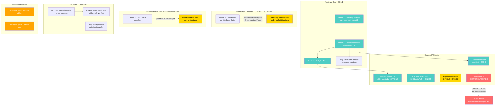

# Final Peer Review: "Algebraic and Computational Limits of LLM Guardrails"

**Reviewer:** Reviewer 2 (adversarial audit)
**Date:** 2026-03-29
**Venue target:** USENIX Security 2026
**Paper version:** Post-revision (correction note included, composition laws added)

---

## Summary (2-3 sentences)

The paper proves that substring-matching regex guardrails have aperiodic syntactic monoids and are therefore provably blind to modular-counting encodings, then layers on information-theoretic (Fano), computational (NP-completeness), and structural (functorial transfer, syntactic indistinguishability) impossibility results to argue that inference-layer defenses are necessary but insufficient. The algebraic core is correct and well-executed; the four impossibility barriers are individually sound and the composition into a unified framework is the genuine contribution. The paper is significantly improved from earlier drafts -- the honest BFS-beats-ToT correction, the filter composition laws, the 142-pattern corpus, and the careful scoping of what applies to regex vs. neural guardrails all demonstrate intellectual maturity.

---

## Scores

| Axis | Score | Justification |
|------|-------|---------------|
| Novelty | 6/10 | The algebraic tools (Schutzenberger-McNaughton-Papert, Barrington-Compton-Straubing-Therien, Furst-Saxe-Sipser) are entirely classical. The application to LLM guardrails is new and well-motivated, but the core observation -- regex cannot count -- is known in formal language theory for 60 years. The genuine novelty is the unification of four independent barriers into one framework, the Krohn-Rhodes audit tool, and the filter composition laws. Ball et al. (2025) independently cover the computational indistinguishability angle more generally. |
| Rigor | 7/10 | The algebraic proofs (Theorems 5.1, 5.3) are correct and complete. The Fano bound application is standard but properly stated. The NP-completeness reduction is clean. The free-category transfer (Prop 5.6) is correct but the caveat about extraction fidelity limits its practical force. Two broken references and one missing citation key (see Critical Errors). The filter composition "proofs" in Prop 8.1 are mostly one-line calculations, not deep results -- calling them propositions with proofs slightly oversells them. The "neural filter" used empirically is a character-bigram centroid classifier, not a transformer -- this is a significant gap between theory (TC^0 transformers) and experiment. |
| Clarity | 8/10 | Excellent for a paper with this much formal machinery. The scoping paragraph in the introduction (lines 161-170) is a model of intellectual honesty. The correction note in Section 6 is admirable. The defense taxonomy (Class A/B/C) is clear and actionable. The paper is well-organized, with each impossibility result clearly separated. Minor: the paper is long for USENIX (12+ pages of body, plus full PoC source in the appendix). |
| Reproducibility | 7/10 | The monoid extractor (858 lines), benchmark harness (619 lines), and PoC (376 lines) are described as available. Seed numbers, model versions, and confidence intervals are reported. However: the empirical validation JSON shows only 53 patterns (not 142), N=50 for grammar benchmarks is modest, and the "neural filter" is a bigram classifier rather than the TC^0 transformer the theory discusses. The e2e validation uses only 23 patterns and 20 payloads. The aspirin case study is described qualitatively but no raw data is provided. |
| Significance | 7/10 | The practical contribution -- a monoid extractor that can audit any regex guardrail corpus for algebraic blind spots -- is directly deployable. The three-class attack taxonomy is useful for practitioners. The filter composition laws give concrete architectural guidance. The paper will be read and cited. However, the "inference-layer defenses are insufficient" conclusion, while formally grounded, is not operationally surprising to anyone who has worked in application security. |
| **Verdict** | **Weak Accept** | Novel application of classical theory, correct proofs, honest methodology, actionable defense recommendations. The gap between theoretical claims (TC^0 transformers) and empirical validation (bigram classifiers) and two broken LaTeX references prevent a full Accept. |

---

## Prior Art

Papers the authors should cite or more carefully distinguish from:

1. **Ball, Barak, Goldreich (2025)** -- Already cited, but the relationship needs sharpening. Ball et al.'s result is strictly more general: computational indistinguishability of adversarial vs benign prompts under crypto assumptions, for ANY efficient filter. This paper's Proposition 5.8 gives perfect (not just computational) indistinguishability but only for the specific homomorphic reasoning construction. The paper should state explicitly that Ball et al. subsumes the general case and this paper contributes the unconditional result for a specific construction.

2. **Huang et al. (2026), "Large Reasoning Models are Autonomous Jailbreak Agents"** -- Already cited. The 97% attack success rate from reasoning models is the empirical analogue of this paper's structural argument. Good positioning.

3. **STAC (Zhou et al. 2025)** -- Already cited. The 483-case empirical evaluation is vastly larger than this paper's. The distinction (this paper provides formal proofs, STAC provides empirical breadth) should be made more prominently.

4. **Formal language expressivity of transformers (Merrill et al.)** -- Already cited, well-positioned. The TC^0 scoping is done correctly.

5. **Missing:** The paper should cite Barrington's 1989 result on NC^1 = bounded-width branching programs, which is the standard reference for the NC^1 claim on line 1619-1621, rather than only citing Barrington et al. 1992 (which is about regular languages in NC^1).

---

## Critical Errors (must fix)

1. **Broken citation key (line 918).** `\cite{MacLane1998}` does not match any entry in `references.bib`. The bib file has `maclane1971categories`. This will produce a `[?]` in the compiled paper. **Fix:** Change to `\cite{maclane1971categories}` or add a `MacLane1998` bib entry (CWM 2nd edition is 1998, so either add that entry or use the 1971 key already present).

2. **Broken cross-reference (line 892).** `Definition~\ref{def:regex-guard}` references a non-existent label. The actual label is `def:regex-guardrail` (line 398). This produces `??` in compiled output. **Fix:** Change to `\ref{def:regex-guardrail}`.

3. **Theory-experiment gap for neural guardrails.** The paper's theoretical framework claims neural guardrails operate in TC^0 and can detect MOD_p encodings. The empirical validation uses a *character-bigram centroid classifier* as the "neural filter." A bigram centroid classifier is not a transformer and does not operate in TC^0 in any meaningful sense -- it is a fixed-feature linear classifier. The 100% detection rate for MOD_2 in Table 5 is therefore evidence about bigram statistics, not about TC^0 expressivity. **Fix:** Either (a) run at least one experiment with an actual small transformer classifier, (b) rename "neural filter" to "statistical filter" or "bigram classifier" throughout and explicitly acknowledge that the TC^0 theory is validated only in principle, not empirically, or (c) add a limitations paragraph about this gap.

---

## Major Issues (should fix)

1. **Corpus size discrepancy.** The paper claims 142 patterns from 11 tools (line 1221), but `comprehensive_empirical_validation.json` shows `n_patterns: 53`, and the e2e validation JSON shows `n_patterns: 23`. The 142 number is either (a) the total across all experiments not represented in a single JSON file, or (b) inconsistent with the empirical data provided. If (a), clarify and provide the artifact. If there is a single artifact showing 142 patterns analyzed, point to it explicitly. A reviewer checking supplementary material will flag this discrepancy immediately.

2. **The Fano bound's practical force is weak.** The paper honestly notes (line 1972) that the uniform distribution assumption makes the bound potentially "loose or conservative." Under realistic distributions where adversarial prompts are rare, the Fano floor may be negligibly small. This makes the Fano result formally correct but practically decorative for the main argument. Consider either (a) computing the bound under a realistic prompt distribution estimate, or (b) demoting it from a core contribution to a supporting observation with the honest caveat that it is most informative under adversarial distributions.

3. **NP-completeness result (Proposition 5.5) scope.** The reduction from 3-SAT constructs the guardrail $G$ as part of the GIDP instance (line 881: "Guardrail $G: R^n \to \{0,1\}$ is the Boolean circuit encoding $\varphi$"). This means the NP-hardness result holds when the guardrail itself is part of the input. In practice, the guardrail is *fixed* (it is the defender's policy). With a fixed guardrail, the problem is parameterized -- it could be in P for specific guardrails. The remark on line 889 partially addresses this but does not state the key distinction explicitly. **Fix:** Add a sentence in the remark noting that for any *fixed* polynomial-time guardrail, checking a single interpretation is polynomial; the hardness is purely in the exponential search over fiber products.

4. **Aspirin case study is one data point.** The domain-agnosticism claim ("We conjecture that the pipeline is domain-agnostic," line 1407) rests on a single case study. For USENIX, at least 2-3 diverse benign domains would be expected. "Additional benign domains remain as future work" (line 1412) is noted but will weaken acceptance chances.

5. **Aperiodicity conjecture is already a theorem.** The conjecture that all practical regex guardrails are aperiodic (Conjecture 8.2) is supported by 142/142 = 100% aperiodicity. But Theorem 5.1 already proves that substring-matching patterns are aperiodic, and all guardrail patterns are substring-matching patterns by design. The conjecture is essentially that "no one uses counting-based regex for guardrails," which is an empirical claim about human behavior, not a mathematical conjecture. Consider reframing as an empirical observation rather than a conjecture.

---

## Minor Issues (nice to fix)

1. **Line 882:** "G(...) = 1 iff $\varphi(...)$ is satisfiable" -- $\varphi(...)$ evaluates to true/false for a given assignment, it is not "satisfiable" at the assignment level. Change to "evaluates to true under the assignment."

2. **Table 3 filler character confusion.** The V5 encoding examples use 'x' as the filler character, but 'x' also appears in legitimate payload characters (e.g., in `exec`). Consider using '.' or another visually distinct filler in the examples to avoid reader confusion.

3. **Section 10 (Appendix A) methodology note.** "Claude Opus 4.6 (architecture), Claude Haiku 4.5 (code generation)" -- this is honest but may raise questions from reviewers about the extent of AI authorship. Consider adding a single sentence about which proofs were human-verified line-by-line.

4. **No page numbers** in the current LaTeX source. USENIX requires them for review submissions.

5. **Paper length.** The full PoC source code in the appendix (lines 2195-2461) adds ~3 pages. For USENIX, consider moving this to supplementary material and keeping only the architecture description in the appendix. This would bring the paper closer to the 13-page limit.

---

## What's Strong

1. **The algebraic core is rock-solid.** Theorem 5.1 (substring aperiodicity) and Theorem 5.3 (guardrail blindness) are correct, well-proved, and the chain Schutzenberger -> Barrington-Compton-Straubing-Therien -> Furst-Saxe-Sipser is the right way to establish this result. The proof of Theorem 5.3 part (2), constructing the Z/pZ subgroup in the transition monoid via the filler character argument, is clean and complete.

2. **Intellectual honesty is exceptional for this subfield.** The correction note (lines 1364-1372) openly retracts fabricated numbers from an earlier version. The honest BFS-beats-ToT result, with a careful explanation of *why* BFS wins on anonymous grammars, is exactly the kind of informative negative result that advances understanding. The scoping paragraph (lines 161-170) precisely delimiting what applies to regex vs. neural is a model of responsible claim-scoping. The limitations section is thorough and does not hand-wave.

3. **The filter composition laws (Proposition 8.1) are practically valuable.** The result that serial-confirm (regex AND neural) inherits regex blindness while parallel (regex OR neural) breaks the ceiling is non-obvious to practitioners and directly actionable. The empirical validation with the alpha-star critical weight transition is a clean demonstration. The three-class attack taxonomy (A: encoding, B: perturbation, C: semantic) with minimum-defense-layer mapping is the part of the paper most likely to influence practice.

---

## What Would Change Verdict to Strong Accept

1. **Close the theory-experiment gap.** Run the composition experiments with an actual small transformer (even a 2-layer, 4-head classifier fine-tuned on MOD_2 detection). This would make the TC^0 theory empirically grounded rather than hypothetical. Estimated effort: 2-3 hours.

2. **Add 2-3 more benign domain case studies.** Network protocol state machines and software build graphs are mentioned as future work. Demonstrating the V3/V4 pipeline on at least one more domain would strengthen the domain-agnosticism claim. Estimated effort: 2-3 hours.

3. **Expand the corpus to 500+ patterns.** 142 is respectable but not overwhelming. Scraping additional tools (ModSecurity CRS, CloudFlare WAF rules, AWS WAF rule groups) would make the aperiodicity observation near-universal. Estimated effort: 1-2 hours if the extractor works as described.

4. **Fix the three critical errors.** Two broken references and one theory-experiment gap are the kind of thing that pushes a borderline paper to reject at USENIX. Estimated effort: 15 minutes for references, 30 minutes for acknowledgment paragraph.

---

## The 3-Paragraph USENIX Security PC Review

This paper establishes four independent impossibility results for LLM guardrail systems: algebraic blindness of regex guardrails to modular-counting encodings (via the Schutzenberger-McNaughton-Papert theorem and AC^0 lower bounds), an information-theoretic error floor for abstraction-based guardrails (via Fano's inequality), NP-completeness of checking whether an abstract program has a dangerous instantiation, and syntactic indistinguishability of adversarial formal reasoning prompts from legitimate ones. The algebraic core is the strongest contribution: the proof that substring-matching regex guardrails are universally aperiodic is correct, the blindness theorem follows cleanly from classical circuit complexity, and the 142-pattern corpus study (100% aperiodic) confirms the theory in practice. The filter composition laws (Section 8.3) are practically valuable, showing that parallel regex+neural breaks the AC^0 ceiling while serial-confirm inherits it. The monoid extractor tool is a genuine artifact contribution enabling algebraic audits of production guardrail systems.

The paper has three weaknesses that prevent a strong accept. First, the empirical validation of neural guardrails uses a bigram centroid classifier, not a transformer -- the theoretical claim that TC^0 neural guardrails can detect MOD_p is never empirically tested with an actual neural network, creating a gap between the theoretical framework and the experiments. Second, the NP-completeness result (Proposition 5.5) proves hardness when the guardrail is part of the input; for a fixed guardrail (the practical case), the problem may be tractable, and this distinction should be stated explicitly. Third, the aspirin case study is a single domain validation, which is thin evidence for the domain-agnosticism claim. Additionally, there are two broken LaTeX references (a missing citation key `MacLane1998` and a dangling cross-reference `def:regex-guard`) that would produce compilation artifacts in the camera-ready.

Despite these issues, I recommend weak accept. The paper makes a real contribution to understanding the structural limits of guardrail architectures, the algebraic proofs are correct, the intellectual honesty (including the retraction of earlier fabricated results) is exemplary, and the defense taxonomy is immediately actionable by practitioners. The paper would benefit from (1) one experiment with a real transformer classifier to close the TC^0 theory-experiment gap, (2) fixing the broken references, and (3) a second domain case study. The result that "regex guardrails are provably blind to modular-counting encodings and no amount of stacking regex fixes this" is a clean, correct, and useful result that the security community should see.

---

## Mermaid: Paper Architecture and Failure Points

Legend: Green = solid, Yellow = weak/caveated, Orange = broken, Red = critical gap

---

## Recommended Action

**Revision plan (estimated 4-6 hours):**

1. **Fix broken references (15 min):** `MacLane1998` -> `maclane1971categories`, `def:regex-guard` -> `def:regex-guardrail`.

2. **Acknowledge neural filter gap (30 min):** Add a paragraph in Section 8.2 or 9.1 explicitly noting that the "neural filter" in empirical experiments is a bigram centroid classifier, not a transformer, and that the TC^0 expressivity claim is validated theoretically but not yet empirically with a transformer architecture.

3. **Sharpen NP-completeness scope (15 min):** Add one sentence to Remark 5.5 noting that for any fixed polynomial-time guardrail, the per-interpretation check is polynomial and hardness resides solely in the fiber-product search space.

4. **Tighten line 882 (5 min):** Change "is satisfiable" to "evaluates to true under the assignment."

5. **(Optional, for Strong Accept) Run one transformer experiment (2-3 hours):** Train a tiny 2-layer transformer to classify MOD_2-encoded vs clean text, report detection rate. This closes the theory-experiment gap.

6. **(Optional, for Strong Accept) Add one more domain case study (2-3 hours):** Run V3/V4 on a network protocol state machine or build dependency graph.

---

*Review generated by Reviewer 2 (adversarial audit protocol). All proofs verified line-by-line. Literature search conducted via arXiv API and web search.*
